[](https://opensource.org/licenses/MIT)

<p align="left">
    
    
    
    
</p>

# banking-campaign-management

# description

- This project is to build a web application for

## Table of Contents

- [Installation](#installation)
- [User Story](#user-story)
- [Usage](#usage)
- [Usage Concept](#usage-screenshots)
- [Acceptance Criteria](#acceptance-criteria)
- [Tests](#tests)
- [Credits](#credits-and-helpful-resources)
- [License](#license)
- [Questions](#questions)
- [Contributions](#contributions)

## Installation

Follow these instructions to create your project and deploy it to GitHub Pages:

1. Create a new repository on your GitHub account and clone it to your computer.

2. When you're ready to deploy, use the git add, git commit, and git push commands to save and push your code to your GitHub repository.

3. Navigate to your GitHub repository in the browser and then select the Settings tab on the right side of the page.

4. On the Settings page, select Pages on the left side of the page. On the GitHub Pages screen, choose main in the dropdown under Branch. Click the Save button.

5. Navigate to <your-github-username.github.io/your-repository-name> and you will find that your new webpage has gone live! For example, if your GitHub username is "lernantino" and the project is "css-demo-site", then your URL would be <lernantino.github.io/css-demo-site>.

6. To ensure that the node_modules folder is not pushed in the GITHUB, the .gitignore has to be updated and included.

7. This project has been deployed with Render and MongoDB Atlas

## User-Story

```md
AS A Marketing Campaign Manager of a Financial institution
I WANT access to a portal to Define, Manage and View:
Business rules
Product offerings
Customers
SO THAT I effectively and automatically offer the applicable banking products to eligible and interested customers.
```

## Usage

**Link for the repository :**

https://github.com/shwetakadam5/banking-campaign-management

**Link for the deployed application :**

https://banking-campaign-management.onrender.com

## Usage Concept

#### 1. **\_banking-campaign-management :Overall Concept**

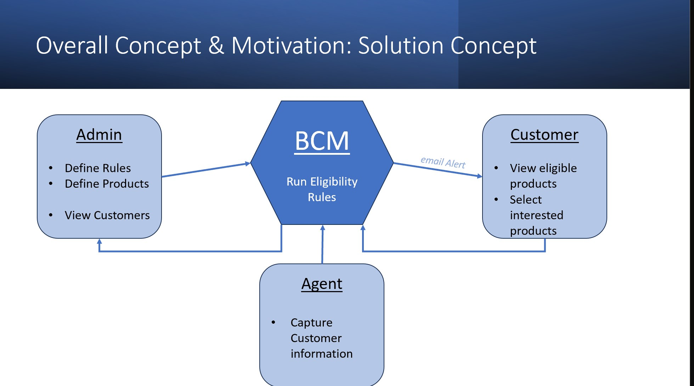

## Acceptance-Criteria

```md
User – Admin

Given a Campaign Management Portal
When I visit the site for the first time
Then I am presented with a Login Page with an option to enter my username and password

When I enter my username and password
Then I am navigated to a home page where the customers already captured by the agents are displayed

When I Navigate to Rules tab
Then I am displayed with a list of all rules already defined.

When I click Add rule
Then I am presented with a form to capture the rule attribute, operand and rule value

When I click Delete rule
Then the system validates if a rule is attached to a product. If no, I am allowed to delete. If Yes, a valid error message is displayed.

When I Navigate to Products tab
Then I am displayed with a list of all products already defined.

When I click Add product
Then I am presented with a form to capture the product details and attach the applicable rules created above.

When I click Edit product
Then I am presented with a form prefilled with the product details captured above and I can modify the product attributes and rule mapping

---

User – Marketing Agent

Given a Campaign Management Portal
When I visit the site for the first time
Then I am presented with a Login Page with an option to enter my username and password

When I enter my username and password
Then I am navigated to a form wherein I am able to capture the customer details

When I click Submit
Then I am presented with a success message and the details are successfully captured in the system.

When I click Submit
Then System runs the customer details against the rules captured against all products and automatically assigns the eligible products to the customer.

---

User – Customer

Given a Campaign Management Portal
When I have provided all my details to the marketing agent
Then an email is triggered to me informing me of the login credentials

When I visit the site for the first time
Then I am presented with a Login Page with an option to enter my username and password

When I enter my username and password
Then I am navigated to a home page where the products offered to me are listed and I can select the products I am interested in

When I click submit
My selection is successfully captured and I can view my selection at a later point in time.
```

## Tests

#### 1. **_banking-campaign-management :Auto Email Sent to Customer with Autogenerated PWD On Creation of customer by the marketing agent: :_**

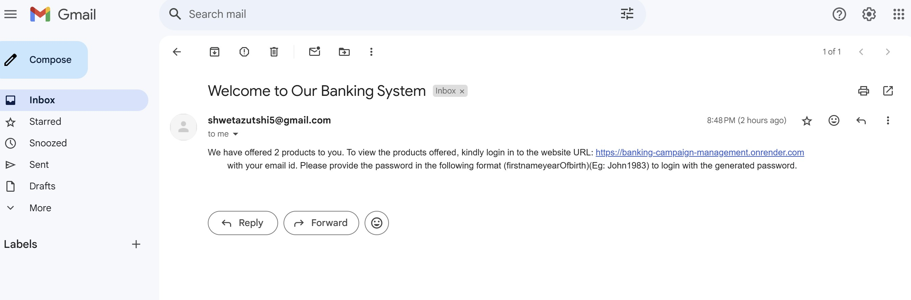

#### 2. **_banking-campaign-management :Admin : View Customers:_**

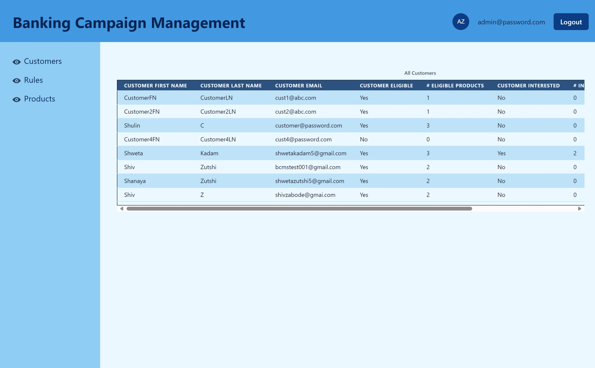

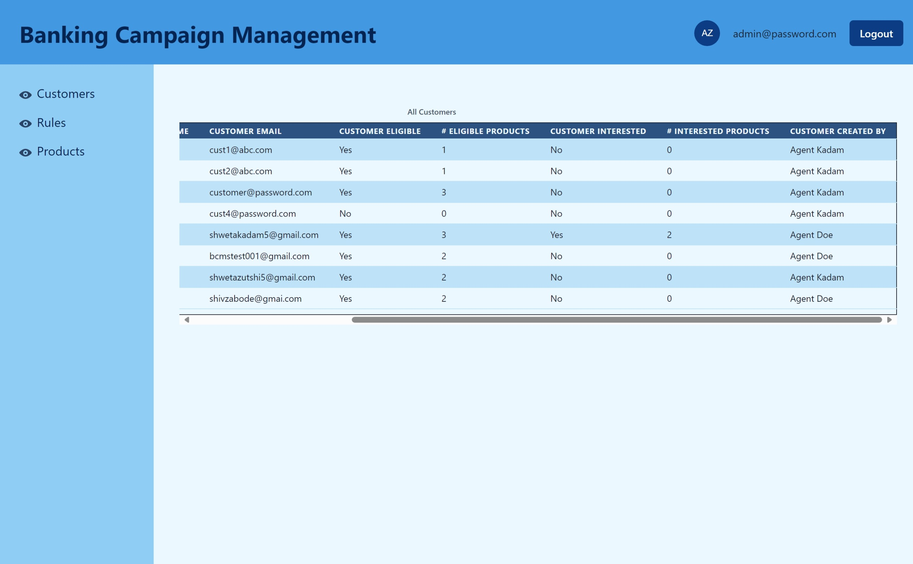

#### 3. **_banking-campaign-management :Admin : View Rules:_**

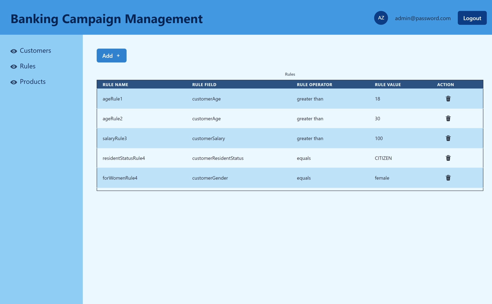

#### 4. **_banking-campaign-management :Admin : Add Rules:_**

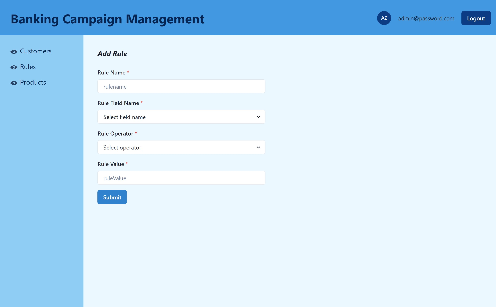

#### 5. **_banking-campaign-management :Admin : Delete Rules Alert:_**

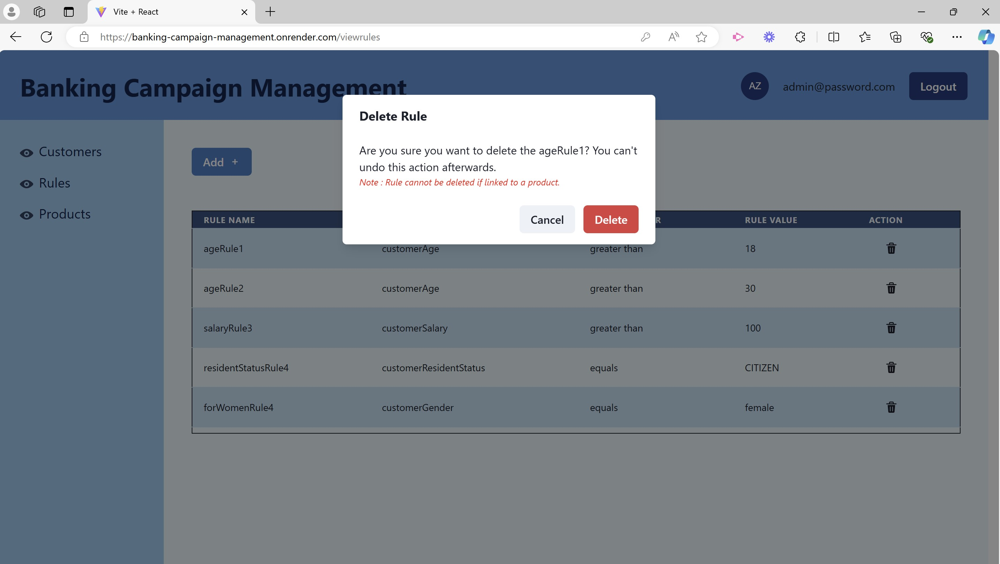

#### 6. **_banking-campaign-management :Admin : View Products:_**

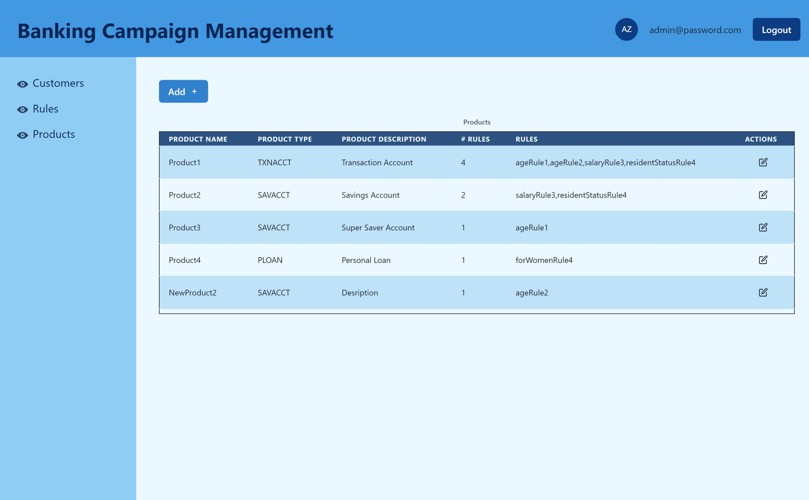

#### 7. **_banking-campaign-management :Admin : Add Product:_**

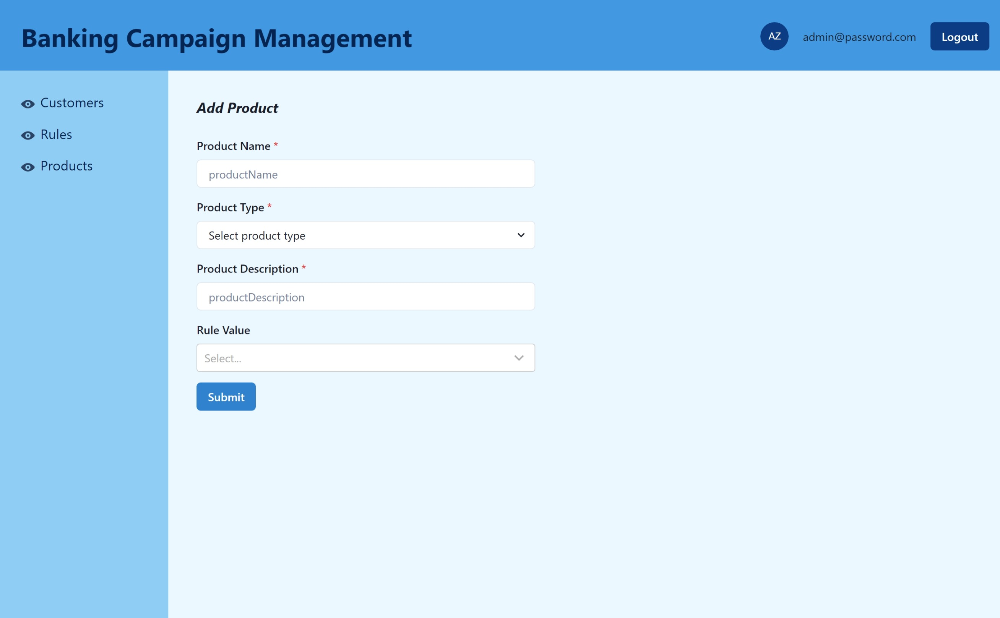

#### 8. **_banking-campaign-management :Admin : Edit Product:_**

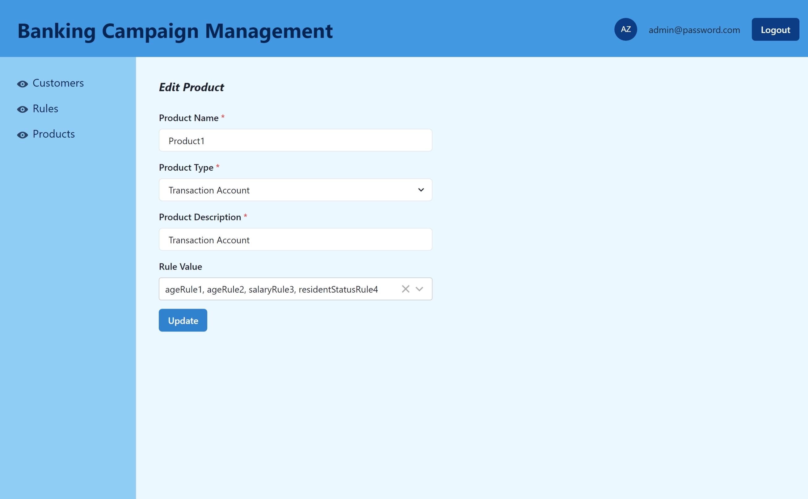

#### 9. **_banking-campaign-management :Agent : Add Customer:_**

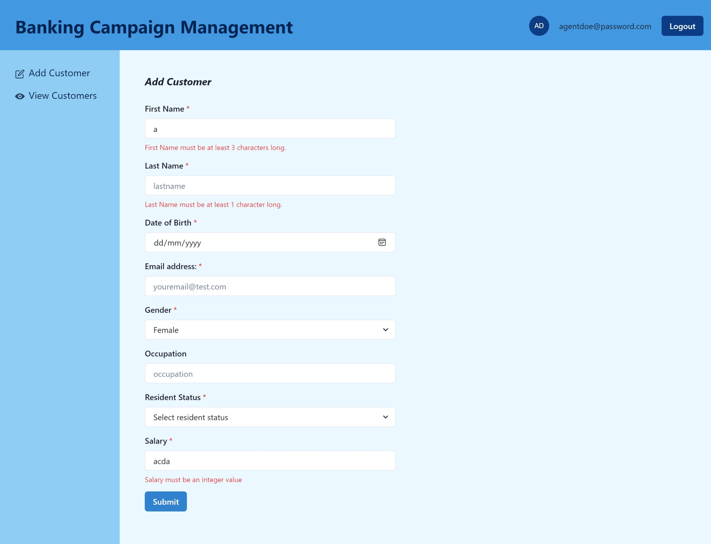

#### 10. **_banking-campaign-management :Agent : Add Customer FormValidations:_**

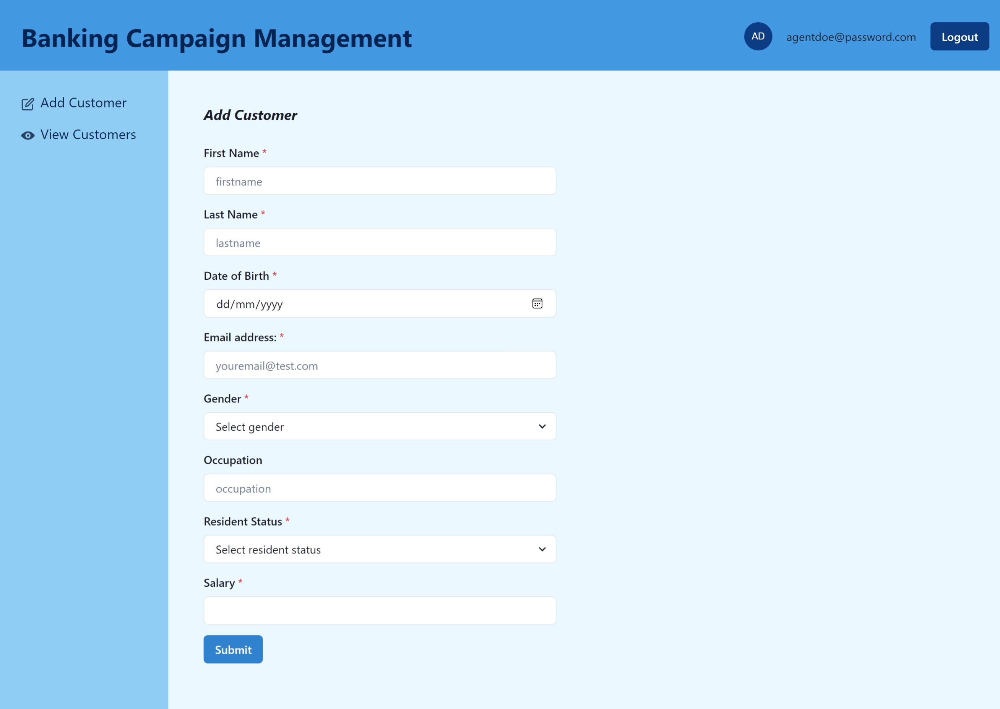

#### 11. **_banking-campaign-management :Agent : View Customers:_**

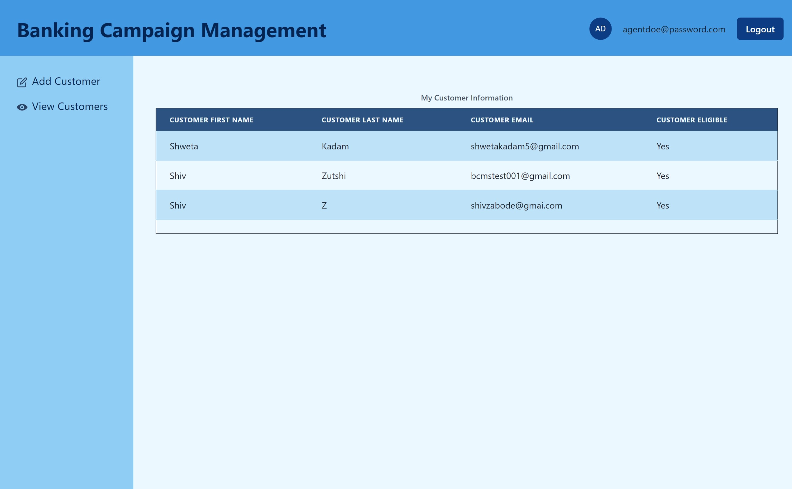

#### 12. **_banking-campaign-management :Agent : Customer Creation Auto Sends Email To Customer:_**


#### 13. **_banking-campaign-management :Customer: View Products Offered:_**

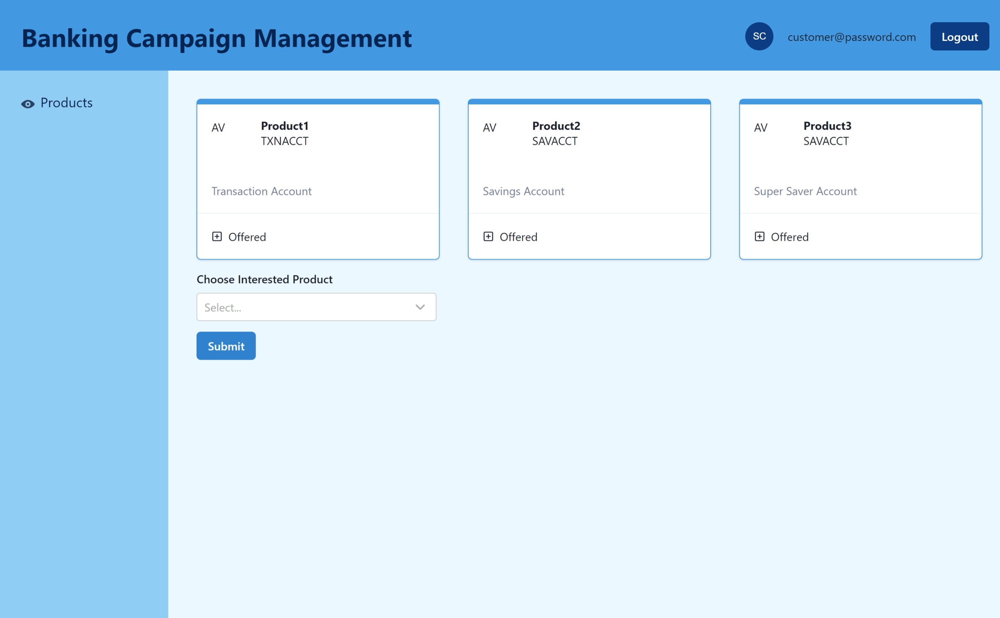

#### 14. **_banking-campaign-management :Customer: Submits interest in product:_**


## Credits and Helpful Resources

- [Deploy with Render and MongoDB Atlas](https://coding-boot-camp.github.io/full-stack/mongodb/deploy-with-render-and-mongodb-atlas)
- [Chakra-UI ](https://v2.chakra-ui.com/)
- [Nodemailer](https://nodemailer.com/)

## License

> [MIT License](https://opensource.org/licenses/MIT)

## Questions

> _For any queries, please feel free to contact on the following :_
>
> > - Git Hub Profile : <https://github.com/shwetakadam5>
> > - E-mail Address : <shwetakadam5@gmail.com>

## Contributions

[](https://www.contributor-covenant.org/version/2/1/code_of_conduct/code_of_conduct.md)

This project welcomes contributions and suggestions and anyone can contribute to this repo.To make sure your contribution aligns with our code of conduct adopted, please make sure to review it before submitting.

To contribute your own examples, [fork the repo](https://docs.github.com/en/pull-requests/collaborating-with-pull-requests/working-with-forks/about-forks), [create a new branch](https://docs.github.com/en/pull-requests/collaborating-with-pull-requests/proposing-changes-to-your-work-with-pull-requests/), make your changes or additions, and then [submit a pull request](https://docs.github.com/en/pull-requests/collaborating-with-pull-requests/proposing-changes-to-your-work-with-pull-requests/about-pull-requestsabout-branches).

Thanks to all the contributors.


